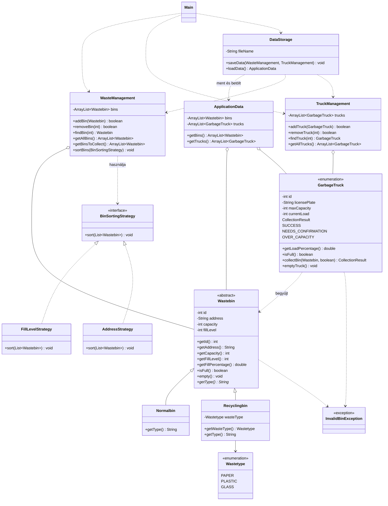

# UML osztálydiagram

A diagram a Smart Waste Management rendszer főbb osztályait, azok fontosabb kapcsolatait és a Strategy tervezési minta megvalósítását szemlélteti.

```mermaid
classDiagram
    class Wastebin {
        <<abstract>>
        -int id
        -String address
        -int capacity
        -int fillLevel
        +getId() int
        +getAddress() String
        +getCapacity() int
        +getFillLevel() int
        +getFillPercentage() double
        +isFull() boolean
        +empty() void
        +getType()* String
    }

    class Normalbin {
        +getType() String
    }

    class Recyclingbin {
        -Wastetype wasteType
        +getWasteType() Wastetype
        +getType() String
    }

    class Wastetype {
        <<enumeration>>
        PAPER
        PLASTIC
        GLASS
    }

    class GarbageTruck {
        -int id
        -String licensePlate
        -int maxCapacity
        -int currentLoad
        +getLoadPercentage() double
        +isFull() boolean
        +collectBin(Wastebin, boolean) CollectionResult
        +emptyTruck() void
        <<enumeration>>
        CollectionResult
        SUCCESS
        NEEDS_CONFIRMATION
        OVER_CAPACITY
    }

    class ApplicationData {
        -ArrayList~Wastebin~ bins
        -ArrayList~GarbageTruck~ trucks
        +getBins() ArrayList~Wastebin~
        +getTrucks() ArrayList~GarbageTruck~
    }

    class WasteManagement {
        -ArrayList~Wastebin~ bins
        +addBin(Wastebin) boolean
        +removeBin(int) boolean
        +findBin(int) Wastebin
        +getAllBins() ArrayList~Wastebin~
        +getBinsToCollect() ArrayList~Wastebin~
        +sortBins(BinSortingStrategy) void
    }

    class TruckManagement {
        -ArrayList~GarbageTruck~ trucks
        +addTruck(GarbageTruck) boolean
        +removeTruck(int) boolean
        +findTruck(int) GarbageTruck
        +getAllTrucks() ArrayList~GarbageTruck~
    }

    class BinSortingStrategy {
        <<interface>>
        +sort(List~Wastebin~) void
    }

    class FillLevelStrategy {
        +sort(List~Wastebin~) void
    }

    class AddressStrategy {
        +sort(List~Wastebin~) void
    }

    class DataStorage {
        -String fileName
        +saveData(WasteManagement, TruckManagement) void
        +loadData() ApplicationData
    }

    class InvalidBinException {
        <<exception>>
    }

    class Main

    Wastebin <|-- Normalbin
    Wastebin <|-- Recyclingbin
    Recyclingbin --> Wastetype
    GarbageTruck ..> Wastebin : begyűjt
    ApplicationData o-- Wastebin
    ApplicationData o-- GarbageTruck
    WasteManagement o-- Wastebin
    TruckManagement o-- GarbageTruck
    BinSortingStrategy <|.. FillLevelStrategy
    BinSortingStrategy <|.. AddressStrategy
    WasteManagement ..> BinSortingStrategy : használja
    DataStorage ..> ApplicationData : ment és betölt
    DataStorage ..> WasteManagement
    DataStorage ..> TruckManagement
    Main ..> WasteManagement
    Main ..> TruckManagement
    Main ..> DataStorage
    Wastebin ..> InvalidBinException
    GarbageTruck ..> InvalidBinException
```
